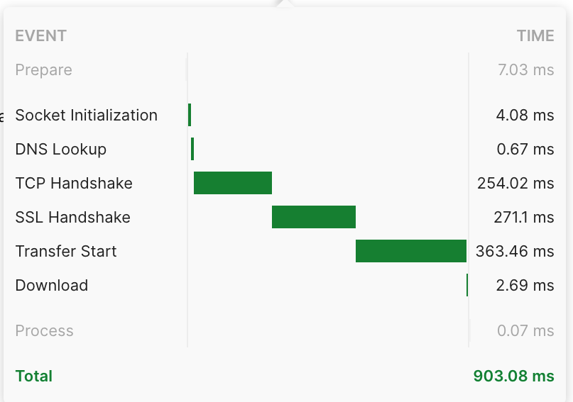
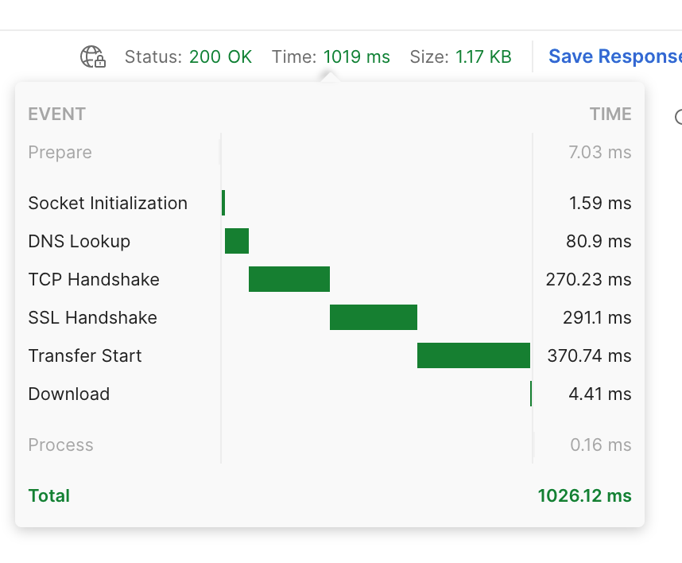
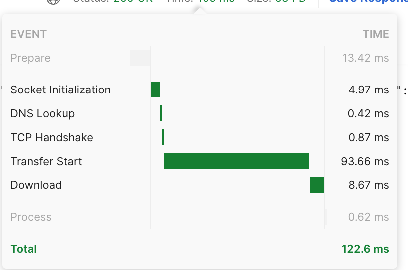
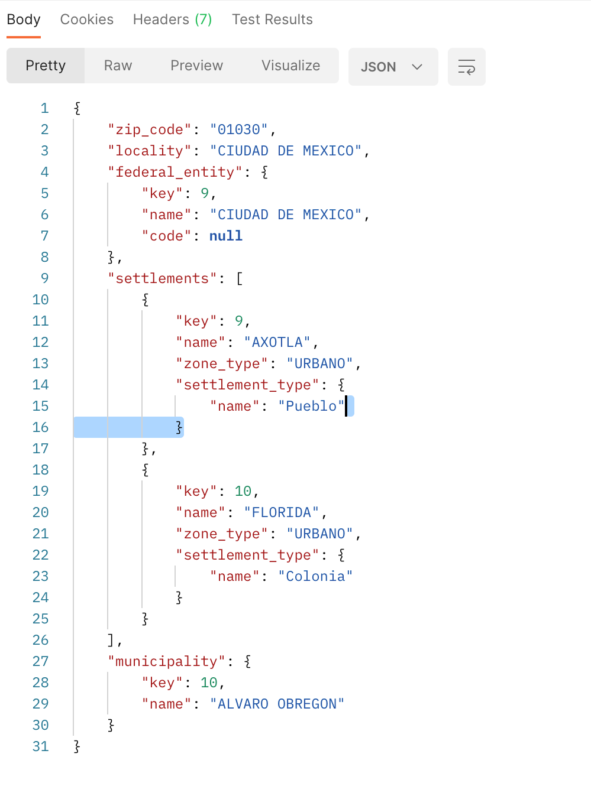

# BackBone Challenge

The project is written in the Lumen micro framework. You can see the official documentation down. It is espetially for the rest api applications. 
I used mysql for database. I also downloaded zip codes for Mexico in txt format, in the folder seeders/ZipCodesNoSqlSeeder.php , you can get the code saved in the database. 
Because requeriments explained the time is important, I made a table in the database called ZIPS. The table has 2 columns, one is ID and the other one is DATA. 
On the ZipCodesNoSqlSeeder I passed the TXT to JSON, and after that I save the fields with a chunk array to a limit of 1000 register per time. 
So, the method to get the data is very simple. This is because the data is formated already. I think it is a good solution, because data needs to be saved in a format that will be used. 
Of course, that means duplication of data, but in nosql formats that is normal. Time is the most  important factor. 
I must say thanks for this oportunity to take part in  this challenge. I hope to get the chance to work in your company.  
## Times
<table>
<tr><th>My solution Times</th><th>Example Times</th></tr>
<tr>
    <td></td>
    <td></td>
</tr>

<tr><th>Local Times</th><th>My Reponse example</th></tr>
<tr>
    <td></td>
    <td></td>
</tr>

</table>

# Tech Documentation
For this project I was Install, on a Digital Ocean Server.  
PHP 7.4.29 (cli) (built: Apr 12 2022 10:55:38) ( NTS ) 
mysql  Ver 15.1 Distrib 10.5.15-MariaDB, for Linux (x86_64) using readline 5.1 
flipbox/lumen-generator: ^9.1 
laravel/lumen-framewor": ^8.3.1 

## Official Documentation

Documentation for the framework can be found on the [Lumen website](https://lumen.laravel.com/docs).

